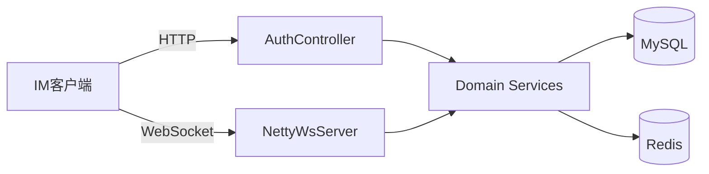

# 架构设计

## 总体架构

## 技术栈
- **后端:** Spring Boot（Java 17）
- **网关:** Netty WebSocket（gateway 模块）
- **数据:** MyBatis-Plus + MySQL
- **缓存/会话:** Redis（结合 Caffeine 依赖用于本地缓存场景）
- **认证:** JWT（jjwt）

## 核心模块关系（以代码结构为准）
- `com.miniim.auth`: HTTP 鉴权与 token 管理
- `com.miniim.gateway`: WebSocket 接入、握手鉴权、会话注册、消息封装
- `com.miniim.domain`: 领域实体/Mapper/Service（会话、群组、消息、ack 等）
- `com.miniim.common`: 通用返回体与异常处理
- `com.miniim.config`: MyBatis-Plus 与线程池等基础配置